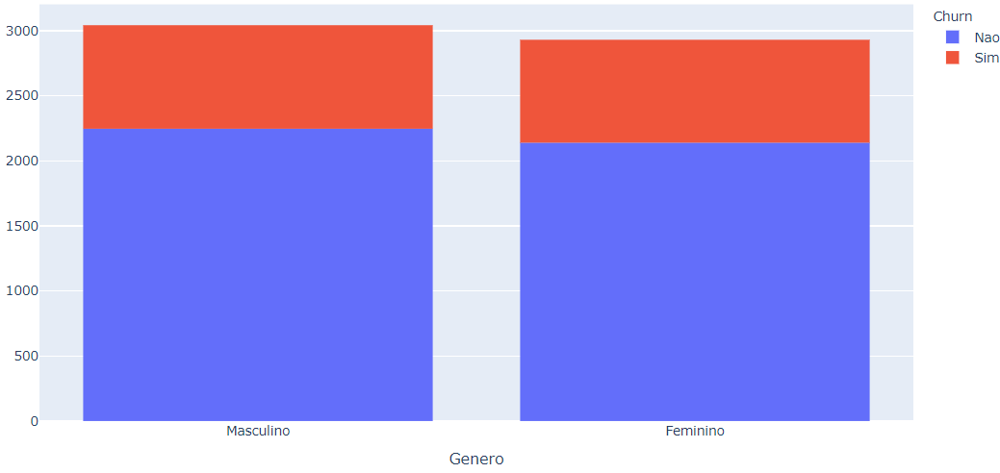
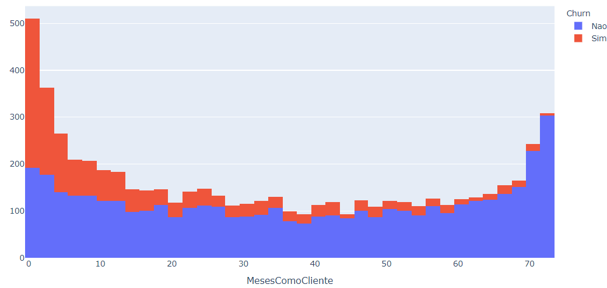
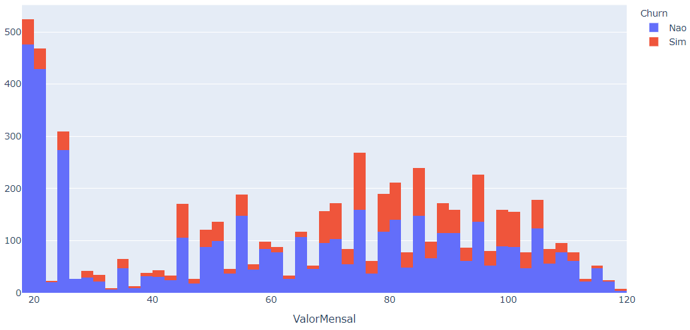
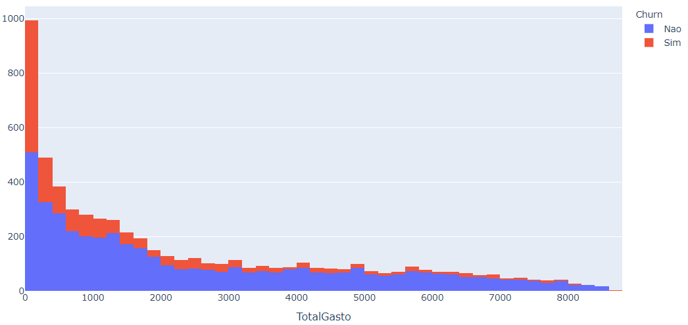
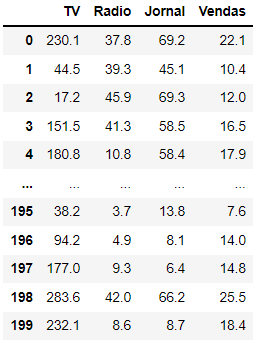
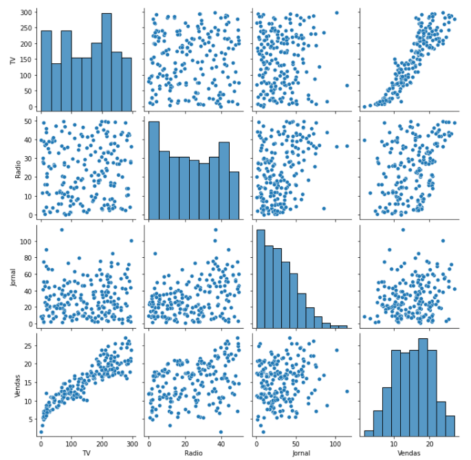
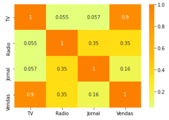
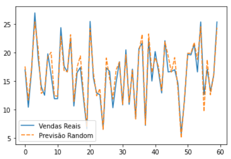
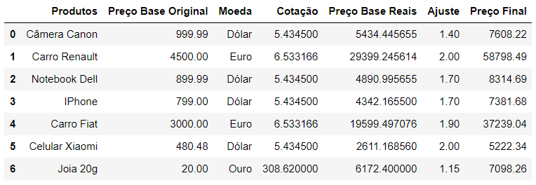

# Tasks Automation
Automação de rotinas diárias utilizando o Python como ferramenta para o fomento da produtividade.

## 1 - Extração de dados externos e automação de tarefas
### Desafio
Todos os dias o nosso sistema atualiza as vendas do dia anterior. O seu trabalho diário, como analista, é enviar um e-mail para a diretoria, assim que começar a trabalhar, com o faturamento e a quantidade de produtos vendidos no dia anterior.
 ***Como é possível automatizar estes processos repetitivos para aumentar a produtividade no escritório?***
- E-mail da diretoria: seugmail+diretoria@gmail.com
- Local onde o sistema disponibiliza as vendas do dia anterior: https://drive.google.com/drive/folders/1mhXZ3JPAnekXP_4vX7Z_sJj35VWqayaR?usp=sharing  

### Bibliotecas Utilizadas
- `pandas` -> Permite a interação com arquivos e planilhas
- `pyautogui` -> Automação do mouse e teclado
- `time` -> Controla o tempo de processamento do programa
- `pyperclip` -> Habilita as funções copiar/colar

## 2 - Limpeza e análise de base de dados
### Desafio
Você trabalha em uma empresa de telecom e tem clientes de vários serviços diferentes, entre os principais: internet e telefone.
O problema é que, analisando o histórico dos clientes dos últimos anos, você percebeu que a empresa está com Churn de mais de 26% dos clientes.
Isso representa uma perda de milhões para a empresa. ***O que a empresa precisa fazer para resolver isso?***

### Bibliotecas Utilizadas
- `pandas` -> Permite a interação com arquivos e planilhas
- `plotly.express` -> Criação de gráficos a partir de base de dados
<h4>
Gênero x Churn
</h4>

  

<h4>
Meses como Cliente x Churn
</h4>

<h4>
Valor Mensal x Churn
</h4>

<h4>
Total Gasto x Churn
</h4>

## 3 - Análise de Dados e Previsão de Vendas
### Desafio
Prever as vendas que vamos ter em determinado período com base nos gastos em anúncios nas 3 grandes redes que a empresa Hashtag investe: TV, Jornal e Rádio.
***Qual a importância de cada variável para as vendas?
A empresa está investindo de maneira correta?***

### Bibliotecas Utilizadas
- `pandas` 
- `seaborn`
- `matplotlib.pyplot`
- `sklearn.model_selection > train_test_split`
- `sklearn.linear_model > LinearRegression`
- `sklearn.ensemble > RandomForestRegressor`
- `sklearn > metrics`

<h4>
Criação de tabela a partir de base de dados
</h4>

<h4>
Gráfico de Vendas
</h4>

<h4>
Análise Estatística do Coeficiente de Precisão
</h4>

<h4>
Gráfico de Previsão das Vendas
</h4>

## 4 - Extração de dados da WEB e conversão de moedas
### Desafio
Trabalhamos em uma importadora e o preço dos nossos produtos é vinculado a cotação de:
- Dólar
- Euro
- Ouro  
 Precisamos buscar através da WEB, de forma automática, a cotação desses 3 itens e saber quanto devemos cobrar pelos nossos produtos, considerando uma margem de contribuição que temos na nossa base de dados.  
***Como é possível automatizar estes processos utilizando a WEB como ferramenta de busca e obter uma atualização automática das cotações?***

- Base de Dados: https://drive.google.com/drive/folders/1QHOQt1J7d5Z4sBFKL9GN699OcPh2aVaP?usp=sharing

### Bibliotecas Utilizadas
- `selenium > webdriver`
- `selenium.webdriver.common.keys > Keys`

<h4>
Tabela criada após a extração e tratamento de dados
</h4>

